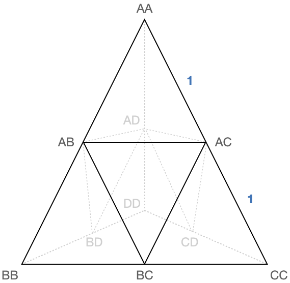
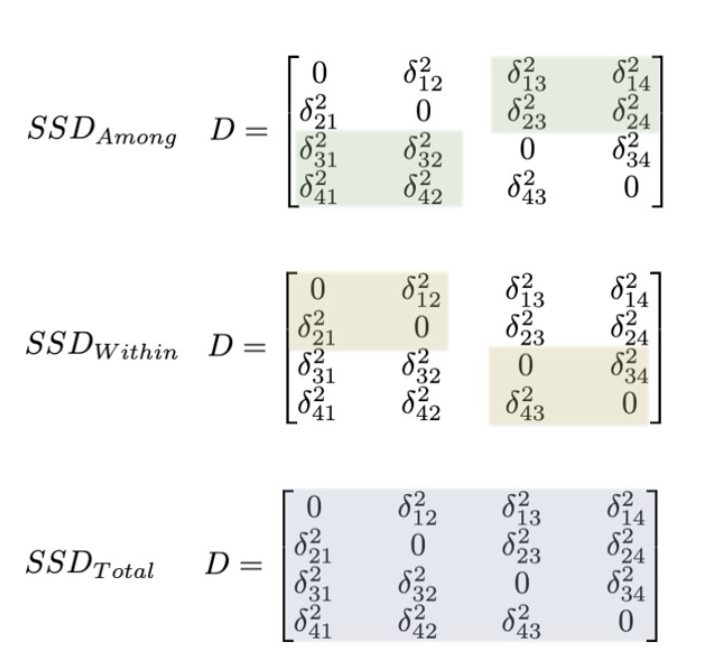

```{r setup, include=FALSE}
knitr::opts_chunk$set( echo = FALSE,
                       message = FALSE )
library( knitr )
library( gstudio )
library( kableExtra )
library( tidyverse )
```


```{css}
.caption { 
  text-align: left;
}
```


## Introduction

To draw an analogy with normal parametric statistics, rejecting the null hypothesis that there is no structure is tantamount to finding a significant $F$ statistic in an analysis of variance.  In all but the most simple cases, the immediate next step in parametric statistics is to conduct a *post hoc* test to determine which treatment levels are contributing to this finding, whereas in population genetics the route of action is to either simply interpret the magnitude of the structure statistic in relation to other published organisms whose life-history traits are similar or to conduct a pair-wise analysis of all possible combinations of strata.  The former approach is largely a practice of hand-waving due to the fact that numerous different demographic and genetic histories may lead to a similar level of average among-population genetic structure.  Moreover, the latter suffers from significant loss in actual statistical power&mdash;we rarely sample enough individuals within individual locales when conducting analyses of multiple sampling strata yielding large variation around all of our parameters when each of the $K*(K-1)/2$ pairs of locales.  

If our studies are focused on answering if there is genetic structure, we are justified at stopping here.  However, if the focus of the work is to characterize how variation is distributed across the landscape rather than if there is structure, then we need to proceed further in understanding the contributions each stratum provides to the amount of observed variation.  

In this manuscript, I provide a decomposition of single and multilocus genetic structure whose aim is to understand how genetic variance is distributed.  In doing so, this extends the more prosaic approach to just asking if there is structure (e.g., $F_{ST} > 0$) allowing the researcher to understand the relative contributions to observed genetic structure by individual strata. 


### The Algebra of Structure Statistics

For a single level analysis of structure, the statistic of interest estimates the proportion of the total genetic variance that can be attributable to individuals being assigned to distinct strata.  If considering only a single locus of genotypes, this parameter is called $\theta$ [@WeirCockerham84], whereas if it is additive across loci, it is defined as $\Phi_{ST}$  [@excoffierEtal1992]—a single locus $\Phi_{ST}$ is numerically identical to the $\theta$.  For our purposes, I will use the multilocus form for consistency with the nomenclature provided in [@smousePeakall].

\begin{align}
\tag{1}
\Phi_{ST} = \frac{\sigma_A}{\sigma_A + \sigma_W}
\end{align}

These components can be estimated using the following constructions. Smouse and Peakall -@smousePeakall provided a geometric approach that defines the distances between indiviudal genotypes based upon their allelic composition Figure \@ref(fig:AMOVATriangle).  

```{r AMOVATriangle, fig.cap="Geometry of AMOVA distances for diploid loci.  Each edge segment on the periphery of the tetrahedron has unit length.  The genetic distance between individual geneotypes is the euclidean shortest path on (or through) the structure.", fig.align='center'}

```

Across all possible combinations of alleles at two diploid genotypes, the pairwise genetic distance, $\delta_{ij}^2$ is shown in Table \@ref(tab:amovaDistance).  Multilocus estimates of genetic distance are derived by summing equally across loci (n.b., individual locus weights can be added, though they've rarely been shown to be more informative than equal contributions).

```{r amovaDistance}
df <- data.frame(  loci = c( locus("A:A"),
                             locus("A:B"),
                             locus("A:C"),
                             locus("A:D"),
                             locus("B:B"),
                             locus("B:C"),
                             locus("B:D"),
                             locus("C:C"),
                             locus("C:D"),
                             locus("D:D")) )
D <- genetic_distance( df , mode = "amova")
rownames(D) <- colnames( D ) <- as.character( df$loci )
kable( D, caption="Pairwise squared distance between individual diploid genotypes." ) %>%
  kable_paper(bootstrap_options = "striped", full_width = F) %>%
  column_spec(1, bold=TRUE) 
```

Across all sampled individuals, we can construct the pair-wise genetic distance matrix, $\mathbf{D}$ as: 

\[
D = \left[ 
\begin{array}{cccc} 
0 & \delta_{12}^2 & \cdots & \delta_{1N}^2 \\
\delta_{21}^2 & 0 & \cdots & \delta_{2N}^2 \\
\vdots & \vdots & \ddots & \vdots \\
\delta_{N1} & \delta_{N2} & \cdots & \delta_{NN}^2
\end{array}
\right]
\]


where $\delta_{ij}^2$ represents the squared genetic distance between the $i^{th}$ and $j^{th}$ individuals.  By definiation, the elements of $\mathbf{D}$ are constrained such that $\delta_{ii} = 0$ and $\delta_{ij} \ge 0$.  Configured such that individuals are sorted by sampling stratum, this matrix has a distinct block form, which is informative for identifying the compartments within the matrix that represent genetic distances measured both among and with strata.  The sum of these squared distances subsets (hereafter $SSD_{level}$) can be directly injected into a normal random-effects Analysis of Variance [see @DyerEtAl2004 for a more generalized derivation into general linear models].

```{r MATRIXBlocks, fig.cap="Compartmentalization of pairwise genetic distance matrix into subsets representing the among stratua, within strata, and total sums of squared distances (SSD).", fig.align='center'}

```


The pair-wise distance matrix $\mathbf{D}$ can be converted into a covariance matrix, $\mathbf{C}$, whose elements ($c_{ij}$) are estimated by 

\[
c_{ij} = -0.5( \delta_{ij}^2 - \delta_{i.}^2 - \delta_{.j}^2 + \delta_{..}^2)
\]

where the dot subscripts represent the summation of row and/or column following @gower66.   

Once converted to an R-mode covariance matrix (see @DyerEtAl2004), the variance decomposition proceeds as from a matrix approach as follows.  First, we must define the hypothesis matrix, $\mathbf{X}$ representing the allocation of individuals to one of the $K$ sampled strata (see @JohnsonWichern1992).  From this, the idempotent hypothesis matrix is given as:

\[
\mathbf{H} = \mathbf{X}(\mathbf{X}\mathbf{X}^\prime)^{-1}\mathbf{X}
\]

which allows the estimation of the expected pair-wise covariance (or model) matrix, $\hat{\mathbf{Y}}$ as.

\[
\hat{\mathbf{Y}} = \mathbf{H}\mathbf{C}
\]

The residual variance/covariance matrix is thus defined as:

\[
\mathbf{R} = (\mathbf{I}-\mathbf{H})\mathbf{C}
\]

Each of these outer-product matrices represent the variance/covariance structure for a single-level decomposition.  The total sums of squares (with $N-1$ degrees of freedom) is estimated by the trace of the total covariance matrix,

$$SSD_{Total} = tr(\mathbf{C})$$

The among strata (or model) sum of squared deviations with $K-1$ degrees of freedom is:

$$SSD_{Model} = tr(\hat{\mathbf{Y}})$$

And the residual (error) sums of squares is with $N - K - 1$ degrees of freedom are:

$$SSD_{Error} = tr(\mathbf{R})$$

Each of which are standardized into *Mean Squares* by division of the appropriate degrees of freedom.

Variance component estimation follows the tradiational random effects model because the sampling locales are a subset of potential strata where the organisms exist.  The expectation of the *Mean Squares* for the error term is an unbiased estimator of the within strata variance component.

\[
E[MS_{Error}] = \sigma_W^2
\]

but the among strata componet is given by solving for $\sigma_A^2$ from

\[
E[MS_{Among}] = \sigma_A^2 \nu + \sigma_W^2
\]

where $\nu$ is a coefficient based upon the harmonic mean stratum population size (n.b., the formula for this originally presented for a distance-based approach for estimating population genetic structure in @excoffierEtal1992 has a typo in it, yielding an incorrect value.  See @searle1997 instead).  These variance components are additive in that

$$\sigma_T^2 = \sigma_A^2 + \sigma_W^2$$
which provides direct estimation of the overall magnitude of genetic differentiation (in Eqn. 1 above).  The parameter estimate of $\Phi_{ST}$ and the significance associated with the of the null hypothesis $H_O: \sigma_A^2 = 0$ is commonly found by permuting individuals across strata and interpretation of the results are based upon the operation or lack-thereof of microevolutionary processes.  However either a rejection or failure to reject this null hypothesis is often where the inferences end, perhaps prematurely, without considering how our sampled strata individually contribute to the parameter $\sigma_A^2$.


### Proportional Contribution of Each Stratum


## Examples 


### Simulation of Structure


### Human Genetic Structure   


## Discussion


## Acknowlegements {.appendix}

This work was supported by a grant to RJD by the National Science Foundation (DEB:).  The markdown for this manuscript, the underlying data, and all analyses used in the development of this manuscript are publically available on the [Dyer Laboratory Github](https://github.com/dyerlab/proportional_fst) site.


